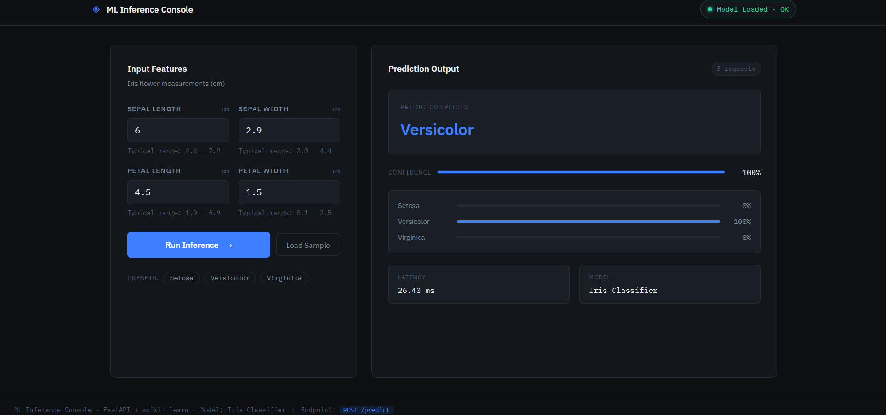

# ML Inference System with Real-Time UI

A production-style machine learning inference system built with **FastAPI** and **scikit-learn**, featuring a clean, professional web UI.

---

## Overview

I built this project to understand how machine learning models are deployed in real-world systems.

It is a FastAPI-based inference system that serves predictions from a trained scikit-learn model, along with a clean UI to interact with it. I focused on performance, scalability, and building a simple end-to-end system.

---

## Tech Stack

| Layer      | Technology                        |
|------------|-----------------------------------|
| Backend    | FastAPI 0.115, Python 3.12        |
| ML Runtime | scikit-learn 1.5, NumPy 1.26      |
| Server     | Uvicorn (ASGI, async)             |
| Templating | Jinja2                            |
| Frontend   | Vanilla HTML / CSS / JavaScript   |
| Container  | Docker (multi-stage build)        |

---

## Features

- **Single model load at startup** — no repeated disk I/O on inference
- **Async request handling** — CPU-bound inference offloaded to thread pool
- **Response latency measurement** — every prediction returns `latency_ms`
- **Structured JSON I/O** — Pydantic schemas with input validation
- **Health endpoint** — model status, feature names, load timestamp
- **Live health indicator** — green/red badge in the UI, polled every 15s
- **Error surfaces** — validation errors shown inline in the UI
- **Preset inputs** — one-click sample data for each Iris species
- **No page reload** — multiple predictions in the same session
- **Docker-ready** — multi-stage build, non-root user, 2 Uvicorn workers
- Tracks number of inference requests in the UI

---

## Demo



## Project Structure

```
ml-inference/
├── app.py                # FastAPI application (routes, model loading, schemas)
├── model.pkl             # Trained sklearn pipeline (pre-generated)
├── requirements.txt      # Python dependencies
├── Dockerfile            # Multi-stage Docker build
├── templates/
│   └── index.html        # Jinja2 HTML template (UI shell)
└── static/
    ├── style.css         # CSS (design tokens, layout, states)
    └── script.js         # JS (API calls, UI state machine, presets)
```

---

## API Reference

### `GET /health`

Returns model and system status.

```json
{
  "status": "ok",
  "model_loaded": true,
  "model_description": "Iris Species Classifier (Random Forest)",
  "model_loaded_at": "2024-01-15T10:30:00Z",
  "feature_names": ["sepal length (cm)", "sepal width (cm)", "petal length (cm)", "petal width (cm)"],
  "uptime_note": "Service is running normally"
}
```

### `POST /predict`

**Request body:**

```json
{
  "sepal_length": 5.1,
  "sepal_width": 3.5,
  "petal_length": 1.4,
  "petal_width": 0.2
}
```

**Response:**

```json
{
  "prediction": "setosa",
  "prediction_index": 0,
  "confidence": 0.99,
  "probabilities": {
    "setosa": 0.99,
    "versicolor": 0.01,
    "virginica": 0.0
  },
  "latency_ms": 2.341,
  "model_description": "Iris Species Classifier (Random Forest)"
}
```

**Validation errors** return `422` with a human-readable `detail` array.

---

## Running Locally

### Prerequisites
- Python 3.10+
- pip

### Steps

```bash
# Clone / enter the directory
cd ml-inference

# Install dependencies
pip install -r requirements.txt

# (Optional) Regenerate the model
python3 -c "
from sklearn.datasets import load_iris
from sklearn.ensemble import RandomForestClassifier
from sklearn.preprocessing import StandardScaler
from sklearn.pipeline import Pipeline
import pickle, time

iris = load_iris()
pipeline = Pipeline([('scaler', StandardScaler()), ('clf', RandomForestClassifier(n_estimators=100, random_state=42))])
pipeline.fit(iris.data, iris.target)
with open('model.pkl', 'wb') as f:
    pickle.dump({'model': pipeline, 'feature_names': iris.feature_names, 'target_names': iris.target_names.tolist(), 'description': 'Iris Species Classifier (Random Forest)'}, f)
print('Done')
"

# Start the server
uvicorn app:app --reload --port 8000

# Open browser
open http://localhost:8000
```

---

## Running with Docker

```bash
# Build the image
docker build -t ml-inference .

# Run the container
docker run -p 8000:8000 ml-inference

# Open browser
open http://localhost:8000
```

---

## Swapping the Model

1. Train your own sklearn pipeline and serialize it:

```python
import pickle

with open("model.pkl", "wb") as f:
    pickle.dump({
        "model": your_pipeline,           # sklearn Pipeline or estimator
        "feature_names": ["feat1", ...],  # list of str
        "target_names": ["class_a", ...], # list of str
        "description": "My Custom Model"
    }, f)
```

2. Update `PredictRequest` in `app.py` to match your feature names.
3. Restart the server — the model loads at startup automatically.

---

## Performance Notes

- The model is loaded **once** into `model_store` at startup — zero disk I/O per request.
- Inference runs in a **thread pool** (`loop.run_in_executor`) to avoid blocking the async event loop.
- Uvicorn runs with **2 workers** in Docker, handling concurrent requests efficiently.
- `StandardScaler` is baked into the pipeline, so no separate preprocessing step is needed per request.

---

## License

MIT
